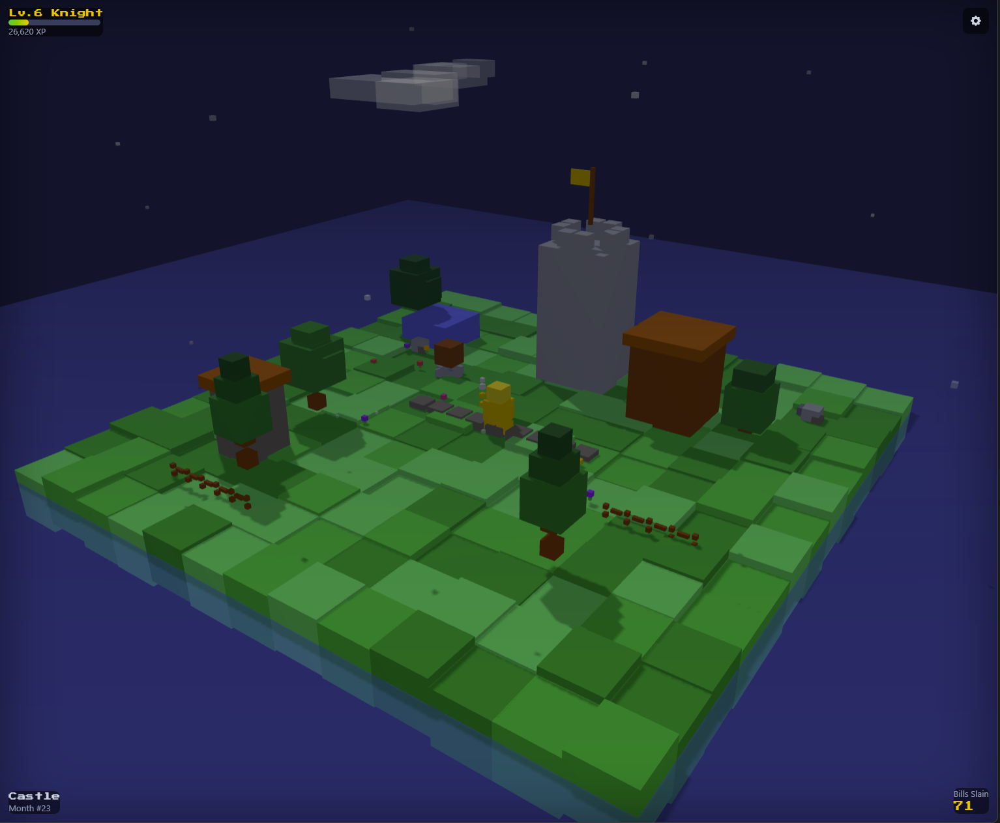
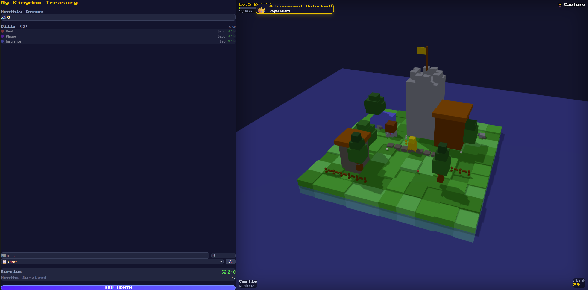
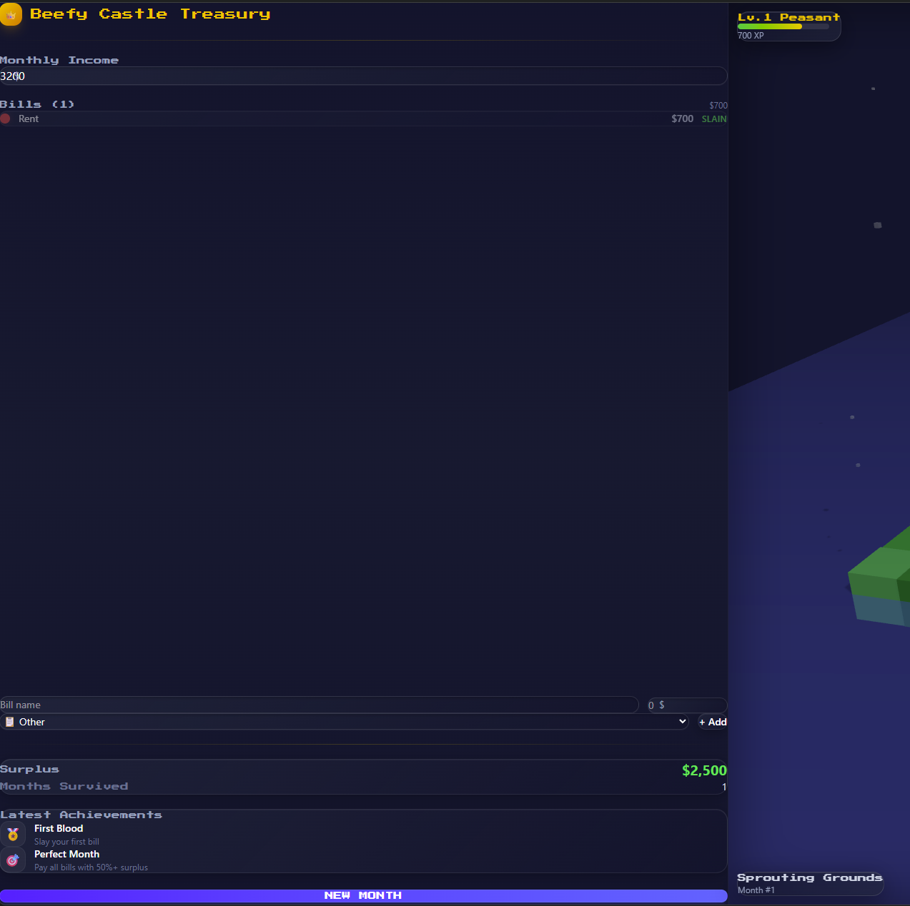

# Payday Kingdom

**Your budget shouldn't feel like a chore. It should feel like a quest.**

[**Play it live**](https://pk-hackathon-claude.vercel.app/)

---

## The Problem

Budgeting apps are boring. Spreadsheets are intimidating. Most people *know* they should track their spending, but the tools available make it feel like homework. There's no dopamine hit for paying your rent on time. No celebration when you stay under budget. No reason to come back next month.

**What if managing money felt like playing a game?**

## What Payday Kingdom Does

Payday Kingdom turns your monthly budget into a tiny fantasy world:

- **Your bills become monsters** that roam a voxel island. Bigger bills spawn bigger creatures.
- **Your payday summons a hero** who drops onto the island and battles every monster one by one, with real-time animations, sound effects, and screen-shake.
- **Your island grows** the longer you stick with it. Stay on budget for months and watch your world evolve from bare dirt to a thriving kingdom with castles, trees, and wildlife.
- **You earn achievements** for milestones like slaying your first bill, surviving months in a row, or reaching a budget surplus.
- **You capture and share** screenshots of your kingdom with friends, complete with a story mode for Instagram-ready portraits.

The core idea: **every responsible financial action gives you an immediate, satisfying visual reward.** You're never staring at a spreadsheet wondering why you bother.

## How It Works

1. **Enter your income and recurring bills.** Each bill spawns a monster on your island, color-coded by category (rent is red, phone is purple, food is green).
2. **Hit "Trigger Payday."** Your hero drops from the sky and fights every monster in sequence with procedural sound effects and battle animations.
3. **Earn XP, level up, grow your island.** Bills paid = XP gained. Your island evolves through 6 stages over time.
4. **Start a new month and do it again.** The loop is addictive because the feedback is instant and visual.

## Screenshots

| Kingdom View | Battle in Progress | Budget Panel |
|:---:|:---:|:---:|
|  |  |  |

## Technology

Everything runs in the browser. No backend. No database. No API calls. Your data never leaves your device.

| Layer | Technology | Why |
|---|---|---|
| **Framework** | React 18 + Vite | Fast dev, instant HMR |
| **3D Engine** | Three.js | All visuals are procedural `BoxGeometry` voxels. Zero imported 3D models, zero external textures, zero sprites. Every tree, castle, monster, and hero is built from code. |
| **State** | Zustand + localStorage | Single store for budget + game state, persisted locally with quota-safe error handling |
| **Styling** | Tailwind CSS | Dark theme with glass morphism, retro pixel font headings, clean sans-serif data |
| **Audio** | Tone.js | 10 procedural retro sound effects (battle slashes, victory fanfares, coin dings, level-up arpeggios). All synthesized at runtime, no audio files. |
| **Hosting** | Vercel | Zero-config deploy from GitHub |

## Architecture

```
src/
  App.jsx                 -- Orchestration, achievement checking, audio init, capture/share wiring
  components/
    Scene.jsx             -- Three.js canvas: 13x13 island, monsters, hero, battle animations,
                             clouds, fish, ambient particles, screen-shake
    BudgetPanel.jsx       -- Income/bill entry, surplus calc, payday trigger
    HUD.jsx               -- Glass overlay stats on the 3D scene
    Onboarding.jsx        -- 5-step first-time setup flow
    LandingPage.jsx       -- Marketing-style entry page for new visitors
    AchievementPanel.jsx  -- 10 unlockable achievements with shareable cards
    ShareModal.jsx        -- Screenshot capture with download, copy, share, and story mode
    AchievementToast.jsx  -- Slide-in notifications on unlock
    CapturePrompt.jsx     -- Post-battle "Capture this victory?" prompt
  lib/
    voxelBuilder.js       -- Factory functions: 8 unique monsters, hero, buildings, trees, clouds, fish
    constants.js          -- Color palette, XP thresholds, bill categories, island stages
    gameState.js          -- Zustand store (budget + game state combined)
    achievements.js       -- 10 achievement definitions + PNG share card generator
    captureUtils.js       -- Scene-to-composited-PNG capture (normal + story mode)
    soundManager.js       -- 10 procedural Tone.js sound effects, lazy init, mute-aware
```

## Key Design Decisions

**Everything is voxels.** Every visual element on screen is built from Three.js `BoxGeometry` blocks at runtime. No imported models. No sprite sheets. This was a deliberate constraint to prove that procedural generation can create a world that feels alive and worth screenshotting.

**The battle animation is the product.** If pressing "Trigger Payday" doesn't feel satisfying, nothing else matters. The hero drops from the sky with a membrane thud, screen-shakes on landing, fights each monster with unique death animations per category, and a victory fanfare plays at the end. Every payday should feel like a tiny celebration.

**Screenshot-first design.** The island is deliberately composed to look great from the default isometric camera angle. Capture and share features are first-class. The goal is that someone screenshots their kingdom and shares it because it looks cool, not because the app told them to.

**Privacy by default.** No accounts. No backend. No analytics. Your financial data lives in `localStorage` on your device and nowhere else.

## The Build Process

This project was built in a 48-hour hackathon window using **Claude Code** as an AI pair programmer.

The process worked in phases:
1. **Core game loop** -- Full working app with budget entry, monster spawning, hero battles, XP/leveling, and island growth in a single session
2. **Visual depth** -- 8 unique monster designs with category-specific death animations, ambient world details (clouds, fish, floating particles, fog, water animation)
3. **Social features** -- Achievement system (10 achievements with toast notifications and shareable PNG cards), screenshot capture with story mode for social media
4. **Sound design** -- 10 procedural retro sound effects synthesized with Tone.js, wired into every meaningful action
5. **Edge cases** -- Zero-bill peaceful paydays, zero-income warnings, 36+ bill support, localStorage quota handling, rapid-click guards
6. **UI polish** -- Multiple iteration passes on every surface: glass morphism HUD, card-based budget panel, 5-step onboarding flow, landing page, modal spacing and padding refinements

Every line of code, every voxel shape, every sound frequency, and every CSS class was written through human-AI collaboration. The human provided creative direction, visual taste, and UX judgment. Claude provided implementation speed, architectural consistency, and tireless iteration.

## Run Locally

```bash
git clone https://github.com/b33fydan/payday-kingdom-hackathon-claude.git
cd payday-kingdom-hackathon-claude
npm install
npm run dev
```

Open [http://localhost:5173](http://localhost:5173) and start your kingdom.

## Credits

Built by **Danny** with **Claude Code** (Anthropic) for the 2025 Claude Code Hackathon.

No external 3D assets. No audio files. No backend. Just code, creativity, and the belief that budgeting should feel like an adventure.

---

*Your finances are your kingdom. Defend it.*
